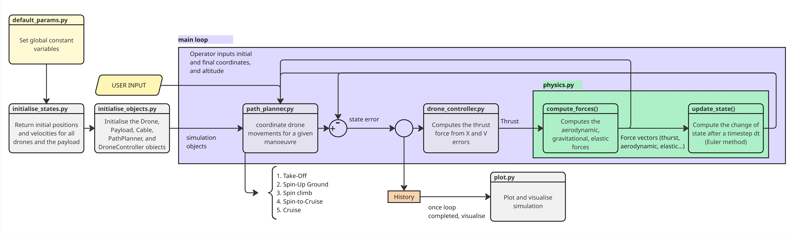

# Spin it up!: Multi-Drone Payload Carrying

## Introduction

This dynamic simulation is a physics-based framework for modeling coordinated movements of multiple drones coupled to a shared payload via cables. The system aims to simulate realistic flight maneuvers including takeoff, spin-up, climb, cruise transitions, and landing, with accurate aerodynamic, gravitational, cable tension, and thrust forces.

**Current Features:**
- Multi-drone dynamics with cable-coupled payload
- Physics-based force modeling (aerodynamic, gravitational, elastic)
- PID-style thrust control from position and velocity errors
- 3D trajectory controller
- State integration using Euler method
- 3D visualization tool

## Quick Start

### Prerequisites
- Python 3.12 or later
- `uv` package manager ([install uv](https://docs.astral.sh/uv/getting-started/installation/))

### Clone and Setup

```bash
# Clone the repository
git clone <repository-url>
cd dynamic-simulation-v2

# Install all dependencies (main + development)
uv sync

# Run the simulation
uv run python main.py
```

### Running Tests

```bash
# Run all tests with verbose output
uv run pytest -v

# Run tests with coverage report
uv run pytest --cov=src --cov-report=term-missing

# Run a single test file
uv run python tests/test_cable_tension.py
```

### Code Quality
Check code style and issues with Ruff
```bash
uv run ruff check src/
```

## File Structure

```
dynamic-simulation-v2/
├── src/
│   ├── core.py                     # Main simulation loop and entry point
│   ├── __init__.py
│   │
│   ├── classes/                    # Core simulation objects
│   │   ├── drone.py                # Drone class: position, velocity...
│   │   ├── payload.py              # Payload class: Coupled though cables
│   │   ├── cable.py                # Cable class: elastic tension modeling
│   │   ├── drone_controller.py     # Thrust force computation from state errors
│   │   ├── path_planner.py         # Maneuver coordination and trajectory (TBD)planning
│   │   └── __init__.py
│   │
│   ├── simulation/                 # Physics engine
│   │   ├── physics.py              # Force calculations and state updates
│   │   └── __init__.py
│   │
│   ├── utils/                      # Initialization and utilities
│   │   ├── default_params.py       # Global constants and simulation parameters
│   │   ├── initial_states.py       # Initial positions/velocities for all objects
│   │   ├── initialise_objects.py   # Functions for object initialisation
│   │   └── __init__.py
│   │
│   └── visualizations/              # Plotting and analysis
│       ├── plot.py                 # 3D trajectory animation, analysis plots
│       └── __init__.py
│
├── tests/                           # Test suite (pytest)
│   ├── test_cable_tension.py        # Cable object tests
│   ├── test_core.py                 # main.py tests
│   ├── test_initial_states.py       # Initial state functions tests
│   └── __init__.py
│
├── data/                            # Data directory (simulation outputs, logs)
├── docs/                            # Documentation
├── main.py                          # Entry point: runs the simulation
├── pyproject.toml                   # Project configuration and dependencies
├── TESTING.md                       # Testing guide overview
├── README.md                        # This file
└── LICENSE
```

## System Architecture



The simulation follows a structured workflow:

### 1. Initialization Phase
- **default_params.py** — Sets global constants (simulation time, number of drones, physical parameters)
- **initial_states.py** — Computes initial positions and velocities for all drones and payload
- **initialise_objects.py** — Instantiates Drone, Payload, Cable, PathPlanner, and DroneController objects

### 2. Main Simulation Loop
For each timestep:

1. **Path Planning** (`path_planner.py`, to be implemented)
   - Receives operator input (initial and final coordinates, altitude)
   - Outputs waypoint targets for collision avoidance and smooth trajectories

2. **Drone controller** (to be implemented)
   - **drone_controller.py** — Computes thrust force based on position (X) and velocity (V) errors
   - Currently a physics informed PD controller, to be modified into state variables


3. **Forces Computation**
   - **physics.compute_forces()** — Calculates all forces:
     - Thrust (from controller)
     - Aerodynamic drag
     - Gravitational force
     - Elastic cable tension
   - **physics.update_state()** — Integrates forces using Euler method to update positions and velocities

4. **History Recording and plotting**
   - Stores state trajectories for all drones and payload at each timestep
   - **plot.py** — Generates:
        - 3D trajectory animations
        - Radius vs. time plots
        - Control gain response analysis

## Branching Conventions

We follow a Git flow model for feature development and bug fixes:

### Workflow

1. **Create a feature branch** from `develop`:
   ```bash
   git checkout develop
   git pull origin develop
   git checkout -b feature/your-feature-name
   ```

2. **Implement your changes** and commit regularly:
   ```bash
   git add src/
   git commit -m "Add feature description"
   ```

3. **Push to remote** and create a Pull Request:
   ```bash
   git push origin feature/your-feature-name
   ```

### Best Practices
- Keep branches focused on a single feature or bug fix
- Commit often and with meaninful commit messages